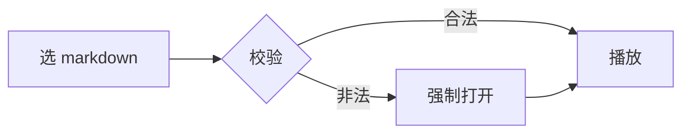

# Open Slideshow

Markdown → 幻灯片 → 演讲

---

## 功能一览

- 首页选片，浏览器缓存历史
- 一键播放，新标签全屏
- 多种风格切换

---

## 代码与图

```js
function hello(name) {
  return `Hello, ${name}!`;
}
```



---

## 双栏布局示例

::: double

左侧内容

:::

::: double

右侧内容

:::

---

## 结束

感谢使用。
